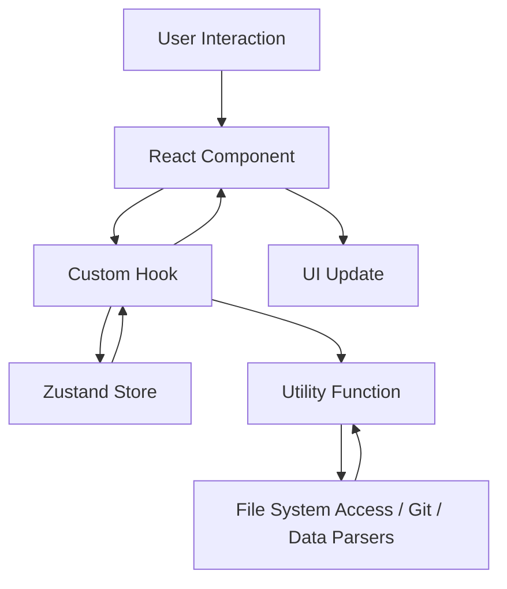

# DataLoom Studio アーキテクチャ設計

## 🏗️ 全体アーキテクチャ

DataLoom Studio は Next.js 15 + React 19 をベースとしたクライアントファースト構成です。Electron 版も同じ Next.js ビルドを取り込み、ブラウザとデスクトップで共通の UI/ロジックを再利用します。

### 設計原則
1. **モジュラー設計** – エディタ、プレビュー、分析、Git などの機能を独立したモジュールとして構成
2. **型安全性** – TypeScript と型付きユーティリティによる堅牢な開発体験
3. **ローカルファースト** – File System Access API と isomorphic-git でブラウザ内完結の操作を実現
4. **漸進的ロード** – dynamic import と遅延初期化により重い依存関係を必要時にロード
5. **LLM フレンドリー** – `llms.txt` / `llms-full.txt` により自動ドキュメント化と AI 連携を最適化

## 📱 レイヤー構造
```
┌─────────────────────────────────────┐
│             Presentation            │
│   (React Components / Tailwind UI)  │
├─────────────────────────────────────┤
│        Interaction & Business       │
│ (Custom Hooks, Zustand Selectors)   │
├─────────────────────────────────────┤
│           Service Utilities         │
│ (ファイルI/O, 変換, 分析, Git)        │
├─────────────────────────────────────┤
│         Persistence & Platform      │
│ (Zustand Store, File System API)    │
└─────────────────────────────────────┘
```

- **Presentation**: `src/components/**` 配下の UI。Tailwind CSS と Headless なコンポーネントで構築。
- **Interaction & Business**: `src/store/` や `src/hooks/`（store 内）で定義した Zustand ストアとカスタムフック。
- **Service Utilities**: `src/lib/` のユーティリティ群（ファイル操作、データ変換、Mermaid レンダリング、Git 操作など）。
- **Persistence & Platform**: File System Access API、IndexedDB ベースの Zustand persist、Electron ブリッジ。

## 🔄 データフロー


- エクスプローラの選択は Zustand ストアに保存され、プレビュー/分析コンポーネントが購読します。
- データファイルはユーティリティ層でパースされ、必要に応じて Web Worker 互換の非同期処理を実行します（現在はメインスレッド、Worker 化を拡張予定）。
- SQL 実行は AlasQL、統計計算は jStat、グラフ描画は Chart.js / Plotly / React Force Graph を利用します。

## 📂 ディレクトリ構成
```
src/
├── app/                 # Next.js App Router エントリ
├── components/
│   ├── analysis/        # 単一・複数ファイル分析 UI
│   ├── editor/          # CodeMirror エディタ
│   ├── explorer/        # ファイルツリーとハンドリング
│   ├── git/             # Git パネル
│   ├── layout/          # レイアウト/ヘッダー/パンくず
│   ├── markdown/        # Markdown プレビュー
│   ├── mermaid/         # Mermaid GUI・レンダリング
│   ├── modals/          # 共通モーダル
│   ├── preview/         # データ/Notebook/PDF プレビュー
│   ├── search/          # 全体検索パネル
│   ├── tabs/            # タブ管理コンポーネント
│   └── theme/           # テーマ制御
├── lib/
│   ├── dataAnalysisUtils.ts
│   ├── dataFormatUtils.ts
│   ├── dataPreviewUtils.ts
│   ├── editorUtils.ts
│   ├── fileSystemUtils.ts
│   ├── git/
│   └── mermaid/
└── store/
    └── editorStore.ts   # Zustand ストアと永続化設定
```

## 🔧 技術スタック
- **UI**: Next.js 15.4 / React 19 / TypeScript 5 / Tailwind CSS 4
- **エディタ**: CodeMirror 6 + @uiw/react-codemirror 拡張
- **状態管理**: Zustand（persist + immer）、Electron 版では IPC を通じて同期
- **データ処理**: AlasQL、PapaParse、Apache Arrow、xlsx、js-yaml
- **可視化**: Chart.js、Plotly.js、Mermaid、React Flow、React Force Graph
- **ファイル I/O**: File System Access API、fflate（Zip/Tar.gz）、isomorphic-git

## 🚀 パフォーマンス最適化
- 分析系モジュールや Plotly は dynamic import で遅延ロード
- テーブル表示はページネーションと列表示制御でメモリ負荷を抑制
- Zustand セレクターで必要な slice のみ購読し再レンダリングを抑制
- Mermaid/Plotly 初期化は 1 度のみ行い、後続はキャッシュしたインスタンスを再利用

## 🔐 セキュリティ
- File System Access API による明示的なユーザー許可が必須
- ローカル処理を徹底し、データは外部サーバーへ送信しない
- Electron 版では `contextIsolation` 有効、IPC は限定的なチャネルに制限

## 📈 将来拡張
- データ処理の Web Worker 化と進行状況 UI
- Cypher 実行エンジンの統合とグラフデータベース接続
- カスタムテンプレート/レポートエクスポートの追加
- i18n 対応とモジュラーなテーマ切替
