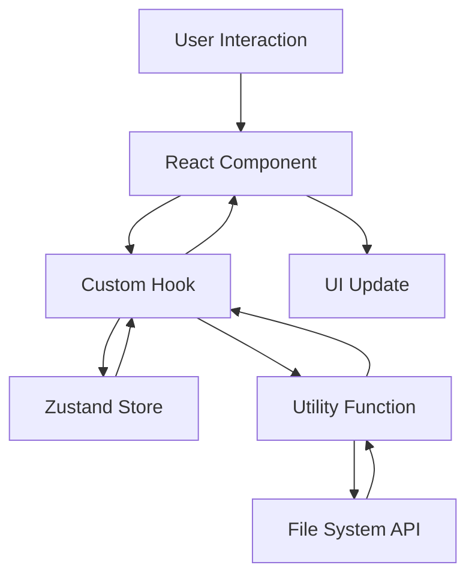

# IDO Editor アーキテクチャ設計

## 🏗️ 全体アーキテクチャ

IDO Editor は Next.js + React をベースとした現代的なWebアプリケーションアーキテクチャを採用しています。

### 設計原則

1. **コンポーネント志向** - 機能ごとの独立コンポーネント設計
2. **型安全性** - TypeScript による厳密な型チェック
3. **状態管理の最適化** - Zustand による軽量状態管理
4. **パフォーマンス重視** - 動的インポートと最適化
5. **拡張性** - プラガブルな機能追加アーキテクチャ

## 📱 レイヤー構造

```
┌─────────────────────────────────────┐
│             Presentation            │
│         (React Components)          │
├─────────────────────────────────────┤
│              Business               │
│           (Custom Hooks)            │
├─────────────────────────────────────┤
│              Service                │
│          (Utility Functions)        │
├─────────────────────────────────────┤
│               Data                  │
│        (Zustand Store + APIs)       │
└─────────────────────────────────────┘
```

### Presentation Layer
- **React Components**: UI表示とユーザーインタラクション
- **Layout Components**: レイアウト管理とページ構成
- **Feature Components**: 各機能固有のコンポーネント

### Business Layer
- **Custom Hooks**: ビジネスロジックの抽象化
- **State Management**: アプリケーション状態の管理

### Service Layer
- **Utility Functions**: 再利用可能な処理ロジック
- **Data Processing**: ファイル処理・変換・分析

### Data Layer
- **Zustand Store**: 集中化された状態管理
- **File System APIs**: ブラウザファイルシステムアクセス

## 🔄 データフロー



## 📂 ディレクトリ構造設計

### コンポーネント組織
```
src/components/
├── analysis/          # データ分析機能
├── editor/           # テキストエディタ
├── explorer/         # ファイルエクスプローラ
├── layout/           # レイアウト管理
├── markdown/         # マークダウン機能
├── modals/           # モーダルダイアログ
├── preview/          # ファイルプレビュー
├── search/           # 検索・置換
└── tabs/             # タブ管理
```

### ライブラリ組織
```
src/lib/
├── dataAnalysisUtils.ts    # データ分析処理
├── dataPreviewUtils.ts     # プレビュー処理
├── editorUtils.ts          # エディタ処理
├── fileSystemUtils.ts      # ファイルシステム
└── tocUtils.ts             # 目次生成
```

## 🔧 技術アーキテクチャ

### フロントエンド
- **Next.js 15.4.5**: React Serverフレームワーク
- **React 19**: 宣言的UI構築
- **TypeScript 5.0+**: 型安全開発
- **Tailwind CSS**: ユーティリティファーストCSS

### 状態管理
- **Zustand**: 軽量状態管理ライブラリ
- **React Query**: サーバー状態管理（将来拡張用）

### データ処理
- **AlasSQL**: ブラウザ内SQL実行
- **jStat**: 統計計算
- **PapaParse**: CSV/TSVパース
- **Apache Arrow**: Parquetデータ処理

### 可視化
- **Plotly.js**: インタラクティブグラフ
- **Chart.js**: 基本チャート描画
- **Mermaid**: ダイアグラム描画
- **React Force Graph**: ネットワーク図

## 🚀 パフォーマンス最適化

### コンポーネント最適化
- **React.memo**: 不要な再レンダリング防止
- **useMemo/useCallback**: 重い計算処理のキャッシュ
- **動的インポート**: 必要時のみモジュール読み込み

### データ処理最適化
- **Web Workers**: バックグラウンド処理（将来拡張）
- **仮想化**: 大容量データテーブル表示
- **ページネーション**: メモリ使用量制限

### ビルド最適化
- **Tree Shaking**: 不要コードの除去
- **Code Splitting**: チャンク分割による初期読み込み高速化
- **バンドルサイズ最適化**: Next.js 最適化機能活用

## 🔐 セキュリティ設計

### データ保護
- **ローカル処理**: データはブラウザ内で処理、外部送信なし
- **File System Access API**: セキュアなファイルアクセス
- **型安全性**: TypeScriptによるランタイムエラー防止

### アクセス制御
- **ブラウザ権限**: ユーザー明示的許可によるファイルアクセス
- **HTTPS必須**: File System Access API セキュリティ要件

## 📈 拡張性設計

### プラガブルアーキテクチャ
- **モジュラー設計**: 機能ごとの独立したコンポーネント
- **設定ベース**: JSON設定による機能カスタマイズ
- **フック型拡張**: Custom Hooks による機能拡張

### 将来拡張予定
- **プラグインシステム**: サードパーティ機能統合
- **テーマシステム**: カスタムテーマ対応
- **言語国際化**: i18n対応
- **PWA化**: オフライン機能とアプリ化