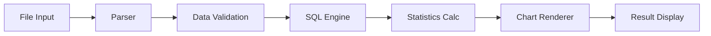

# データ分析機能 詳細仕様

## 🔍 概要

IDO Editor のデータ分析機能は、CSV/TSV/JSON/YAML/Excel/Parquetファイルに対して包括的な分析・可視化機能を提供する高性能分析エンジンです。

## 📊 リファクタリング成果

### Before/After比較
| 項目 | リファクタリング前 | リファクタリング後 | 改善率 |
|------|-------------------|-------------------|--------|
| DataAnalysis.tsx | 3,529行 | 643行 | **82%削減** |
| コンポーネント数 | 1つの巨大コンポーネント | 4つの独立コンポーネント | **保守性向上** |
| TypeScriptエラー | 複数警告 | **0エラー** | **型安全性強化** |
| ビルド時間 | 長時間 | **短縮** | **パフォーマンス向上** |

### 分離されたコンポーネント構造
```
DataAnalysis (643行)
├── AnalysisTabNavigation (115行)    # タブナビゲーション
├── AnalysisSettingsPanel (317行)    # 設定パネル
└── AnalysisChartRenderer (561行)    # チャート描画
```

## 🔧 機能仕様

### 1. 単一ファイル分析モード

#### SQLクエリ実行
- **エンジン**: AlasQL による高性能ブラウザ内SQL実行
- **対応構文**: SELECT, WHERE, GROUP BY, ORDER BY, JOIN
- **特殊機能**: 
  - `?` による簡易テーブル参照
  - 階層データのフラット化クエリ
  - リアルタイム結果表示

```sql
-- 使用例
SELECT column1, COUNT(*) as count 
FROM ? 
WHERE column2 > 100 
GROUP BY column1 
ORDER BY count DESC
```

#### 統計情報表示
pandas.describe()相当の詳細統計分析:

```typescript
interface ColumnInfo {
  type: string;           // データ型
  nonNullCount: number;   // 非null件数
  maxLength: number;      // 最大文字数
  sample: any[];          // サンプル値
}

interface StatsSummary {
  count: number;          // 件数
  mean?: number;          // 平均値
  std?: number;           // 標準偏差
  min?: number;           // 最小値
  '25%'?: number;         // 第1四分位数
  '50%'?: number;         // 中央値
  '75%'?: number;         // 第3四分位数
  max?: number;           // 最大値
}
```

#### チャート作成機能

**対応グラフタイプ (8種類)**:

1. **棒グラフ** - カテゴリ別数値比較
2. **折れ線グラフ** - 時系列・トレンド分析
3. **円グラフ** - 構成比可視化
4. **散布図** - 2変数相関分析
5. **積立棒グラフ** - 多次元カテゴリ比較
6. **線形回帰グラフ** - 回帰分析・予測
7. **ヒストグラム** - データ分布可視化
8. **ガントチャート** - プロジェクトスケジュール・タスク管理

**集計機能**:
- **集計方法**: sum, avg, count, min, max
- **グループ化**: カテゴリフィールドによる多次元分析
- **データソース**: 元データ・クエリ結果の選択可能

### 2. 複数ファイル分析モード

#### ファイル統合機能
```typescript
interface FileJoinConfig {
  type: 'union' | 'intersection' | 'join';
  files: string[];
  joinKey?: string;
  joinType?: 'inner' | 'left' | 'right' | 'full';
}
```

- **UNION結合**: 同一スキーマファイルの縦結合
- **INTERSECTION結合**: 共通データ抽出
- **JOIN結合**: キーによる横結合

#### FROM句指定機能
特定ファイルを対象としたSQLクエリ:

```sql
-- ファイル指定クエリ例
SELECT * FROM sales_data WHERE amount > 1000;
SELECT u.name, o.total 
FROM users u 
JOIN orders o ON u.id = o.user_id;
```

#### クロス集計
複数ファイル間でのピボットテーブル作成と統計的比較。

### 3. 関係性分析

#### Cypherクエリサポート
グラフデータベース形式での関係性探索:

```cypher
// ノード・エッジ関係の可視化
MATCH (a)-[r]->(b) 
WHERE a.type = 'customer' 
RETURN a, r, b
```

#### Force Graphレイアウト
- ノード・エッジの動的操作
- ズーム・パン機能
- インタラクティブ探索

## 🛠️ 技術実装

### 使用ライブラリ

| ライブラリ | 用途 | バージョン |
|-----------|------|-----------|
| **AlasSQL** | ブラウザ内SQL実行 | 最新 |
| **jStat** | 統計計算 | 最新 |
| **Plotly.js** | インタラクティブ可視化 | 最新 |
| **Chart.js** | 基本チャート描画 | 最新 |
| **React Force Graph** | ネットワーク図 | 最新 |

### データ処理パイプライン



### パフォーマンス最適化

#### メモリ効率
- **大容量データ対応**: ページネーション・仮想化
- **メモリリーク対策**: 適切なクリーンアップ処理
- **キャッシュ戦略**: 計算結果のメモ化

#### 計算最適化
- **非同期処理**: Web Workers 活用（将来実装）
- **インクリメンタル計算**: 差分更新による高速化
- **バッチ処理**: 複数操作の一括実行

## 🎨 UI/UX設計

### レスポンシブデザイン
- **モバイル対応**: タッチ操作最適化
- **分割表示**: 設定・結果の効率的レイアウト
- **折りたたみパネル**: 画面領域の有効活用

### ダークモード対応
全分析機能でのテーマ一貫性:
- チャート配色自動調整
- テーブルスタイル統一
- アクセシビリティ配慮

### インタラクション設計
- **リアルタイム更新**: 設定変更の即座反映
- **プログレス表示**: 長時間処理の進捗可視化
- **エラーハンドリング**: 分かりやすいエラーメッセージ

## 🚀 将来拡張計画

### 機械学習機能
- **scikit-learn.js** 統合
- **TensorFlow.js** による予測モデル
- **自動特徴量エンジニアリング**

### 時系列分析
- **ARIMA モデリング**
- **季節調整**
- **異常検知**

### 高度な可視化
- **3D グラフ**
- **地理情報システム (GIS)**
- **リアルタイムダッシュボード**

## 📈 使用例・ベストプラクティス

### 1. 売上データ分析
```sql
SELECT 
  DATE_FORMAT(date, '%Y-%m') as month,
  SUM(amount) as total_sales,
  AVG(amount) as avg_order,
  COUNT(*) as order_count
FROM ? 
GROUP BY month 
ORDER BY month;
```

### 2. 顧客セグメント分析
```sql
SELECT 
  age_group,
  gender,
  AVG(purchase_amount) as avg_purchase,
  COUNT(*) as customer_count
FROM ?
WHERE purchase_amount > 0
GROUP BY age_group, gender
ORDER BY avg_purchase DESC;
```

### 3. 相関分析
散布図 + 線形回帰による相関関係の可視化:
- X軸: price, Y軸: sales_volume
- 回帰線による関係性の定量化

### 4. ガントチャート作成
プロジェクト管理・タスクスケジューリングの可視化:

**必要データ構造**:
```csv
task_name,start_date,end_date,category
設計フェーズ,2024-01-01,2024-01-15,開発
実装フェーズ,2024-01-10,2024-02-28,開発
テストフェーズ,2024-02-20,2024-03-15,品質管理
デプロイ準備,2024-03-01,2024-03-31,運用
```

**設定方法**:
1. チャートタイプで「ガントチャート」を選択
2. **タスク名フィールド**: タスクの名前（例: task_name）
3. **開始日フィールド**: タスク開始日（例: start_date）
4. **終了日フィールド**: タスク終了日（例: end_date）
5. **カテゴリフィールド**: グループ分け（例: category、オプション）

**対応用途**:
- プロジェクトマネジメント
- 製造スケジュール管理
- イベント企画・進行管理
- リソース配分計画

## 🔍 トラブルシューティング

### よくある問題
1. **メモリ不足**: 大容量ファイルの分割処理推奨
2. **型エラー**: データクリーニング機能活用
3. **パフォーマンス**: インデックス作成・クエリ最適化

### デバッグ手法
- ブラウザ開発者ツールでのメモリ監視
- SQLクエリの実行計画確認
- エラーログの詳細確認