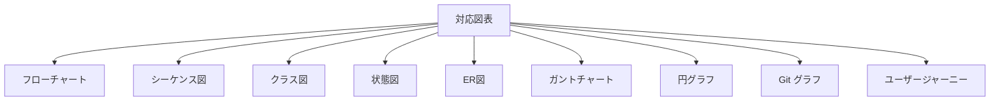

# 機能詳細仕様 - IDO Editor

## 概要

IDO Editor の全機能を詳細に解説した総合的な機能仕様書です。各機能の技術実装、使用方法、設定オプションを包括的にカバーしています。

## 🚀 エディタ機能

### マルチタブエディタ

#### 機能概要
複数ファイルを同時に開いて効率的に編集できるタブベースのエディタシステム。

#### 技術仕様
```typescript
interface Tab {
  id: string;               // 一意識別子
  title: string;            // タブ表示名
  content: string;          // ファイル内容
  language: string;         // プログラミング言語
  isDirty: boolean;         // 未保存状態
  filePath?: string;        // ファイルパス
  fileHandle?: FileSystemFileHandle; // ファイルハンドル
}

interface TabState {
  tabs: Map<string, Tab>;
  activeTabId: string | null;
  maxTabs: number;          // 最大タブ数制限
}
```

#### 主要機能
- **タブ追加**: 新規ファイル・既存ファイルのタブ作成
- **タブ切り替え**: クリック・キーボードショートカット対応
- **タブ並び替え**: ドラッグ&ドロップによる順序変更
- **タブ閉じる**: 個別・一括・右側全て閉じる
- **未保存表示**: 変更があるタブの視覚的インジケーター

#### キーボードショートカット
```
Ctrl+T / Cmd+T     : 新しいタブ
Ctrl+W / Cmd+W     : 現在のタブを閉じる
Ctrl+Tab           : 次のタブに移動
Ctrl+Shift+Tab     : 前のタブに移動
Ctrl+1-9           : 指定番号のタブに移動
```

### ファイルエクスプローラ

#### File System Access API 統合
最新のブラウザ API を使用した直接ファイルシステムアクセス。

```typescript
interface FileExplorerState {
  rootDirHandle: FileSystemDirectoryHandle | null;
  fileTree: FileTree | null;
  selectedPath: string | null;
  expandedDirectories: Set<string>;
}

interface FileTree {
  name: string;
  kind: 'file' | 'directory';
  path: string;
  children?: FileTree[];
  handle: FileSystemFileHandle | FileSystemDirectoryHandle;
  size?: number;
  lastModified?: Date;
}
```

#### 対応ブラウザ
- ✅ Chrome 86+
- ✅ Edge 86+
- ✅ Chromium系ブラウザ
- ❌ Firefox (API未対応)
- ❌ Safari (API未対応)

#### セキュリティ機能
- ユーザー明示許可によるアクセス制御
- HTTPS または localhost 必須
- 読み込み・書き込み権限の個別管理

### シンタックスハイライト

#### 対応言語 (50+)
```typescript
const supportedLanguages = [
  // Web開発
  'javascript', 'typescript', 'html', 'css', 'scss', 'json',
  
  // プログラミング言語
  'python', 'java', 'cpp', 'c', 'csharp', 'go', 'rust', 'swift',
  'php', 'ruby', 'kotlin', 'scala', 'dart', 'lua',
  
  // データベース・クエリ
  'sql', 'graphql', 'cypher',
  
  // マークアップ・設定
  'markdown', 'yaml', 'toml', 'xml', 'dockerfile',
  
  // シェル・スクリプト
  'bash', 'powershell', 'batch',
  
  // 関数型言語
  'haskell', 'elm', 'clojure', 'fsharp',
  
  // その他
  'r', 'matlab', 'latex', 'vim'
];
```

#### CodeMirror 6 拡張機能
```typescript
const editorExtensions = [
  basicSetup,                    // 基本セットアップ
  lineNumbers(),                 // 行番号表示
  foldGutter(),                  // コード折りたたみ
  indentOnInput(),               // 自動インデント
  bracketMatching(),             // 括弧対応
  closeBrackets(),               // 括弧自動閉じ
  autocompletion(),              // オートコンプリート
  searchKeymap,                  // 検索キーマップ
  historyKeymap,                 // 履歴キーマップ
  foldKeymap,                    // 折りたたみキーマップ
  completionKeymap,              // 補完キーマップ
  highlightSelectionMatches(),   // 選択文字列ハイライト
];
```

## 📄 マークダウン機能

### リアルタイムプレビュー

#### 実装技術
```typescript
// react-markdown + プラグイン構成
const markdownComponents = {
  code: ({ node, inline, className, children, ...props }) => {
    const match = /language-(\w+)/.exec(className || '');
    const language = match ? match[1] : '';
    
    if (language === 'mermaid') {
      return <MermaidDiagram code={String(children)} />;
    }
    
    return !inline ? (
      <SyntaxHighlighter language={language} {...props}>
        {String(children).replace(/\n$/, '')}
      </SyntaxHighlighter>
    ) : (
      <code className={className} {...props}>
        {children}
      </code>
    );
  }
};
```

#### 対応機能
- **見出し**: H1-H6、自動ID生成
- **リスト**: 順序・非順序、ネスト対応
- **テーブル**: GitHub Flavored Markdown 準拠
- **コードブロック**: 言語指定シンタックスハイライト
- **リンク**: 内部・外部リンク、画像埋め込み
- **数式**: KaTeX による LaTeX 数式レンダリング

### 目次自動生成

#### 生成アルゴリズム
```typescript
interface TOCItem {
  id: string;              // アンカーID
  title: string;           // 見出しテキスト
  level: number;           // 見出しレベル (1-6)
  children: TOCItem[];     // 子見出し
  anchor: string;          // URL フラグメント
}

const generateTOC = (markdown: string): TOCItem[] => {
  const headings = markdown.match(/^#{1,6}\s+.+$/gm) || [];
  
  return headings.map(heading => {
    const level = heading.match(/^#+/)[0].length;
    const title = heading.replace(/^#+\s+/, '');
    const id = title.toLowerCase()
      .replace(/[^\w\s-]/g, '')
      .replace(/\s+/g, '-');
    
    return { id, title, level, children: [], anchor: `#${id}` };
  }).reduce((tree, item) => {
    // 階層構造の構築ロジック
    return buildHierarchy(tree, item);
  }, []);
};
```

### Mermaidダイアグラム

#### 対応図表タイプ


> ℹ️ **C4 図の表示について**
>
> `test_data/mmd/c4.mmd` のような C4Context ダイアグラムは、Mermaid v11 では標準で C4 図の拡張が組み込まれているため、Mermaid Live Editor と同じく人物アイコン付きのノード、境界ボックス、コネクタが描画されます。IDO Editor でも `mermaid.initialize()` を通じて同じ設定が適用されるため、追加のプラグイン導入は不要です。もし濃紺の矩形に `<<person>>` だけが表示される簡易表示になっている場合は、ブラウザのコンソールで外部チャンクの読み込みエラーが発生していないかを確認してください。

#### インタラクティブ機能
```typescript
interface MermaidConfig {
  theme: 'default' | 'dark' | 'forest' | 'neutral';
  zoom: {
    enabled: boolean;
    minScale: number;
    maxScale: number;
  };
  pan: {
    enabled: boolean;
  };
  export: {
    formats: ['svg', 'png'];
    quality: number;
  };
}

const mermaidFeatures = {
  zoom: true,              // ズーム機能
  pan: true,               // パン機能
  export: true,            // SVG/PNG エクスポート
  clipboard: true,         // クリップボードコピー
  fullscreen: true,        // フルスクリーン表示
  autoFit: true,           // 自動サイズ調整
};
```

### Word エクスポート

#### 実装方式
```typescript
import { Document, Packer, Paragraph, TextRun } from 'docx';

const exportToWord = async (markdown: string): Promise<Blob> => {
  const doc = new Document({
    sections: [{
      properties: {},
      children: parseMarkdownToDocx(markdown)
    }]
  });
  
  return await Packer.toBlob(doc);
};

// マークダウン → DOCX 変換
const parseMarkdownToDocx = (markdown: string): Paragraph[] => {
  // マークダウンパース → DOCX 要素変換
  return markdownAst.map(node => convertNodeToDocxElement(node));
};
```

## 👁️ データプレビュー機能

### 対応ファイル形式

#### 表形式データ
```typescript
interface TableData {
  headers: string[];
  rows: Record<string, any>[];
  totalRows: number;
  columnTypes: Record<string, 'string' | 'number' | 'date' | 'boolean'>;
}

// CSV/TSV プレビュー
const csvPreviewConfig = {
  delimiter: 'auto',           // 自動区切り文字検出
  header: true,                // ヘッダー行認識
  skipEmptyLines: true,        // 空行スキップ
  encoding: 'utf-8',           // 文字エンコーディング
  maxRows: 10000,              // プレビュー最大行数
};
```

#### 階層データ
```typescript
interface HierarchicalData {
  raw: any;                    // 元データ
  flattened: Record<string, any>[]; // フラット化データ
  displayMode: 'tree' | 'table';    // 表示モード
  expandedPaths: Set<string>;        // 展開パス
}

// JSON/YAML プレビュー
const hierarchicalConfig = {
  maxDepth: 10,                // 最大階層深度
  collapseLargeArrays: true,   // 大配列の折りたたみ
  arrayThreshold: 100,         // 配列表示閾値
  stringTruncate: 200,         // 文字列切り詰め
};
```

#### Excel ファイル
```typescript
interface ExcelPreviewConfig {
  sheetName?: string;          // シート名指定
  startRow: number;            // 開始行
  startCol: number;            // 開始列
  endRow?: number;             // 終了行
  endCol?: number;             // 終了列
  hasHeader: boolean;          // ヘッダー行の有無
  dateFormat: string;          // 日付フォーマット
}

// 複数シート対応
const excelSheetManager = {
  listSheets: (workbook: any) => string[],
  switchSheet: (sheetName: string) => void,
  previewSheet: (sheetName: string, config: ExcelPreviewConfig) => TableData,
};
```

### 高機能データテーブル

#### コンポーネント機能
```typescript
interface DataTableProps {
  data: Record<string, any>[];
  columns?: ColumnDef[];
  pagination?: PaginationConfig;
  sorting?: SortingConfig;
  filtering?: FilteringConfig;
  editing?: EditingConfig;
  selection?: SelectionConfig;
}

interface PaginationConfig {
  pageSize: number;            // ページサイズ
  pageSizeOptions: number[];   // サイズ選択肢
  showInfo: boolean;           // 件数情報表示
  showNavigation: boolean;     // ナビゲーション表示
}

interface SortingConfig {
  enabled: boolean;
  multiSort: boolean;          // 複数列ソート
  defaultSort?: SortDirection;
}
```

#### TanStack Table 統合
```typescript
const tableInstance = useReactTable({
  data,
  columns,
  getCoreRowModel: getCoreRowModel(),
  getPaginationRowModel: getPaginationRowModel(),
  getSortedRowModel: getSortedRowModel(),
  getFilteredRowModel: getFilteredRowModel(),
  state: {
    sorting,
    columnFilters,
    pagination,
  },
  onSortingChange: setSorting,
  onColumnFiltersChange: setColumnFilters,
  onPaginationChange: setPagination,
});
```

## 📊 データ分析機能

### SQL クエリエンジン

#### AlasSQL 統合
```typescript
interface SQLExecutionConfig {
  engine: 'alasql';
  timeout: number;             // タイムアウト (ms)
  memoryLimit: number;         // メモリ制限 (MB)
  rowLimit: number;            // 結果行数制限
}

const executeSQL = async (
  data: any[], 
  query: string, 
  config: SQLExecutionConfig
): Promise<QueryResult> => {
  try {
    // テーブル登録
    alasql.databases.temp = new alasql.Database();
    alasql.databases.temp.exec('CREATE TABLE dataset');
    alasql.databases.temp.tables.dataset.data = data;
    
    // クエリ実行
    const result = alasql.databases.temp.exec(query);
    
    return {
      success: true,
      data: result,
      executionTime: performance.now() - startTime,
      rowCount: result.length
    };
  } catch (error) {
    return {
      success: false,
      error: error.message,
      suggestion: generateSQLSuggestion(query, error)
    };
  }
};
```

#### 対応SQL構文
```sql
-- 基本的な SELECT 文
SELECT column1, column2, COUNT(*) as count
FROM ?
WHERE condition
GROUP BY column1, column2
HAVING count > 10
ORDER BY count DESC
LIMIT 100;

-- JOIN操作（複数ファイル分析時）
SELECT a.name, b.total
FROM file1 a
INNER JOIN file2 b ON a.id = b.user_id;

-- 集計関数
SELECT 
  COUNT(*) as total_records,
  AVG(price) as avg_price,
  SUM(quantity) as total_quantity,
  MIN(date) as earliest_date,
  MAX(date) as latest_date
FROM ?;

-- ウィンドウ関数
SELECT 
  name,
  sales,
  ROW_NUMBER() OVER (ORDER BY sales DESC) as rank,
  LAG(sales) OVER (ORDER BY date) as prev_sales
FROM ?;
```

### 統計分析エンジン

#### 統計計算実装
```typescript
interface StatisticalSummary {
  descriptive: DescriptiveStats;
  distribution: DistributionStats;
  correlation: CorrelationMatrix;
  outliers: OutlierDetection;
}

class StatisticsEngine {
  // 記述統計
  calculateDescriptive(data: number[]): DescriptiveStats {
    return {
      count: data.length,
      mean: this.mean(data),
      median: this.median(data),
      mode: this.mode(data),
      std: this.standardDeviation(data),
      variance: this.variance(data),
      skewness: this.skewness(data),
      kurtosis: this.kurtosis(data),
      min: Math.min(...data),
      max: Math.max(...data),
      range: Math.max(...data) - Math.min(...data),
      iqr: this.interquartileRange(data),
      percentiles: this.percentiles(data, [25, 50, 75, 90, 95, 99])
    };
  }

  // 相関分析
  calculateCorrelation(data: Record<string, number[]>): CorrelationMatrix {
    const columns = Object.keys(data);
    const matrix: Record<string, Record<string, number>> = {};
    
    columns.forEach(col1 => {
      matrix[col1] = {};
      columns.forEach(col2 => {
        matrix[col1][col2] = this.pearsonCorrelation(data[col1], data[col2]);
      });
    });
    
    return matrix;
  }
}
```

### 回帰分析エンジン

#### 5種類の回帰アルゴリズム実装
```typescript
interface RegressionResult {
  type: RegressionType;
  equation: string;
  coefficients: number[];
  rSquared: number;
  predictions: number[];
  residuals: number[];
  confidenceInterval: [number, number][];
}

class RegressionEngine {
  // 1. 線形回帰: y = ax + b
  linearRegression(x: number[], y: number[]): RegressionResult {
    const n = x.length;
    const sumX = x.reduce((a, b) => a + b, 0);
    const sumY = y.reduce((a, b) => a + b, 0);
    const sumXY = x.reduce((sum, xi, i) => sum + xi * y[i], 0);
    const sumXX = x.reduce((sum, xi) => sum + xi * xi, 0);
    
    const slope = (n * sumXY - sumX * sumY) / (n * sumXX - sumX * sumX);
    const intercept = (sumY - slope * sumX) / n;
    
    return this.formatResult('linear', [slope, intercept], x, y);
  }

  // 2. 多項式回帰: y = a₀ + a₁x + a₂x² + ... + aₙxⁿ
  polynomialRegression(x: number[], y: number[], degree: number): RegressionResult {
    // ガウス消去法による連立方程式解法
    const matrix = this.createVandermondeMatrix(x, degree);
    const coefficients = this.gaussianElimination(matrix, y);
    
    return this.formatResult('polynomial', coefficients, x, y);
  }

  // 3. 指数回帰: y = ae^(bx)
  exponentialRegression(x: number[], y: number[]): RegressionResult {
    // 対数変換による線形化: ln(y) = ln(a) + bx
    const lnY = y.map(yi => Math.log(yi));
    const linear = this.linearRegression(x, lnY);
    
    const a = Math.exp(linear.coefficients[1]);
    const b = linear.coefficients[0];
    
    return this.formatResult('exponential', [a, b], x, y);
  }

  // 4. べき乗回帰: y = ax^b
  powerRegression(x: number[], y: number[]): RegressionResult {
    // 両対数変換: log(y) = log(a) + b*log(x)
    const logX = x.map(xi => Math.log(xi));
    const logY = y.map(yi => Math.log(yi));
    const linear = this.linearRegression(logX, logY);
    
    const a = Math.exp(linear.coefficients[1]);
    const b = linear.coefficients[0];
    
    return this.formatResult('power', [a, b], x, y);
  }

  // 5. 対数回帰: y = a*ln(x) + b
  logarithmicRegression(x: number[], y: number[]): RegressionResult {
    // X軸のみ対数変換
    const lnX = x.map(xi => Math.log(xi));
    const linear = this.linearRegression(lnX, y);
    
    return this.formatResult('logarithmic', linear.coefficients, x, y);
  }
}
```

### グラフ描画エンジン

#### 8種類のグラフ対応
```typescript
interface ChartConfig {
  type: ChartType;
  data: ChartData;
  options: ChartOptions;
  theme: 'light' | 'dark';
}

type ChartType = 
  | 'bar' 
  | 'line' 
  | 'pie' 
  | 'scatter' 
  | 'stacked' 
  | 'regression' 
  | 'histogram' 
  | 'gantt';

class ChartRenderer {
  // Plotly.js チャート
  renderPlotlyChart(config: ChartConfig): void {
    const plotlyData = this.convertToPlotlyFormat(config);
    const layout = this.createPlotlyLayout(config);
    
    Plotly.newPlot(
      config.containerId, 
      plotlyData, 
      layout, 
      { responsive: true }
    );
  }

  // Chart.js チャート  
  renderChartJsChart(config: ChartConfig): void {
    const chartData = this.convertToChartJsFormat(config);
    const options = this.createChartJsOptions(config);
    
    new Chart(config.ctx, {
      type: config.type,
      data: chartData,
      options: options
    });
  }

  // ガントチャート専用レンダラー
  renderGanttChart(config: GanttConfig): void {
    const ganttData = config.data.map(task => ({
      x: [task.startDate, task.endDate],
      y: [task.taskName],
      type: 'bar',
      orientation: 'h',
      marker: {
        color: this.getTaskColor(task.category)
      }
    }));

    Plotly.newPlot(config.containerId, ganttData, {
      xaxis: { type: 'date', title: '日付' },
      yaxis: { title: 'タスク' },
      barmode: 'overlay'
    });
  }
}
```

## 🔍 検索・置換機能

### 全文検索エンジン

#### 検索アルゴリズム
```typescript
interface SearchEngine {
  indexFiles(files: FileTree[]): Promise<SearchIndex>;
  search(query: SearchQuery): Promise<SearchResult[]>;
  replace(replaceQuery: ReplaceQuery): Promise<ReplaceResult[]>;
}

interface SearchQuery {
  pattern: string;             // 検索パターン
  caseSensitive: boolean;      // 大文字小文字区別
  wholeWord: boolean;          // 単語全体マッチ
  useRegex: boolean;           // 正規表現使用
  includePattern: string;      // 含めるファイルパターン
  excludePattern: string;      // 除外ファイルパターン
  maxResults: number;          // 最大結果数
}

class FileSearchEngine implements SearchEngine {
  async search(query: SearchQuery): Promise<SearchResult[]> {
    const results: SearchResult[] = [];
    
    for (const file of this.filteredFiles(query)) {
      const content = await this.readFile(file);
      const matches = this.findMatches(content, query);
      
      matches.forEach(match => {
        results.push({
          file: file.path,
          line: match.lineNumber,
          column: match.columnNumber,
          text: match.lineText,
          match: match.matchText,
          context: this.getContext(content, match)
        });
      });
    }
    
    return results.slice(0, query.maxResults);
  }
}
```

#### 正規表現サポート
```typescript
const regexPatterns = {
  // 一般的なパターン
  email: /\b[A-Za-z0-9._%+-]+@[A-Za-z0-9.-]+\.[A-Z|a-z]{2,}\b/g,
  url: /https?:\/\/[^\s]+/g,
  ipAddress: /\b(?:[0-9]{1,3}\.){3}[0-9]{1,3}\b/g,
  
  // プログラミング関連
  function: /function\s+(\w+)\s*\(/g,
  variable: /(?:var|let|const)\s+(\w+)/g,
  import: /import\s+.*\s+from\s+['"]([^'"]+)['"]/g,
  
  // データパターン
  date: /\d{4}-\d{2}-\d{2}/g,
  number: /-?\d+\.?\d*/g,
  uuid: /[0-9a-f]{8}-[0-9a-f]{4}-[0-9a-f]{4}-[0-9a-f]{4}-[0-9a-f]{12}/g,
};
```

### 一括置換機能

#### 置換アルゴリズム
```typescript
interface ReplaceOperation {
  file: string;
  replacements: Replacement[];
  backup: boolean;             // バックアップ作成
  dryRun: boolean;             // テスト実行
}

interface Replacement {
  line: number;
  column: number;
  length: number;
  oldText: string;
  newText: string;
  contextBefore: string;
  contextAfter: string;
}

class ReplaceEngine {
  async executeReplace(operation: ReplaceOperation): Promise<ReplaceResult> {
    if (operation.backup) {
      await this.createBackup(operation.file);
    }
    
    const content = await this.readFile(operation.file);
    const newContent = this.applyReplacements(content, operation.replacements);
    
    if (!operation.dryRun) {
      await this.writeFile(operation.file, newContent);
    }
    
    return {
      file: operation.file,
      replacementCount: operation.replacements.length,
      success: true,
      preview: operation.dryRun ? newContent : undefined
    };
  }
}
```

## 🎨 テーマ・UI システム

### ダークモード実装

#### テーマ管理
```typescript
interface ThemeSystem {
  currentTheme: 'light' | 'dark' | 'auto';
  colorScheme: ColorScheme;
  preferences: ThemePreferences;
}

interface ColorScheme {
  primary: Record<string, string>;
  secondary: Record<string, string>;
  background: Record<string, string>;
  text: Record<string, string>;
  border: Record<string, string>;
  shadow: Record<string, string>;
}

class ThemeManager {
  constructor() {
    this.initializeTheme();
    this.watchSystemTheme();
  }
  
  private initializeTheme(): void {
    const savedTheme = localStorage.getItem('theme');
    const systemTheme = window.matchMedia('(prefers-color-scheme: dark)').matches ? 'dark' : 'light';
    
    this.setTheme(savedTheme || systemTheme);
  }
  
  private watchSystemTheme(): void {
    window.matchMedia('(prefers-color-scheme: dark)')
      .addEventListener('change', (e) => {
        if (this.currentTheme === 'auto') {
          this.setTheme(e.matches ? 'dark' : 'light');
        }
      });
  }
}
```

### レスポンシブデザイン

#### ブレークポイント設計
```typescript
const breakpoints = {
  sm: '640px',     // モバイル
  md: '768px',     // タブレット
  lg: '1024px',    // デスクトップ
  xl: '1280px',    // 大画面
  '2xl': '1536px'  // 超大画面
};

const responsiveLayouts = {
  mobile: {
    explorer: { width: '100%', order: 1 },
    editor: { width: '100%', order: 2 },
    preview: { width: '100%', order: 3 }
  },
  tablet: {
    explorer: { width: '30%', order: 1 },
    editor: { width: '70%', order: 2 },
    preview: { width: '100%', order: 3 }
  },
  desktop: {
    explorer: { width: '20%', order: 1 },
    editor: { width: '50%', order: 2 },
    preview: { width: '30%', order: 3 }
  }
};
```

この包括的な機能仕様により、IDO Editor の全機能を詳細に理解し、効果的に活用することができます。各機能は独立して動作しつつ、統合されたユーザー体験を提供するように設計されています。