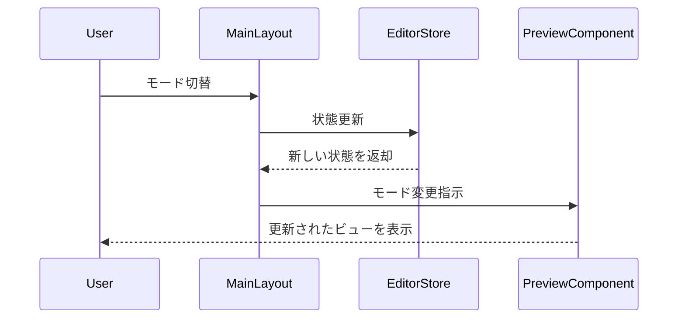
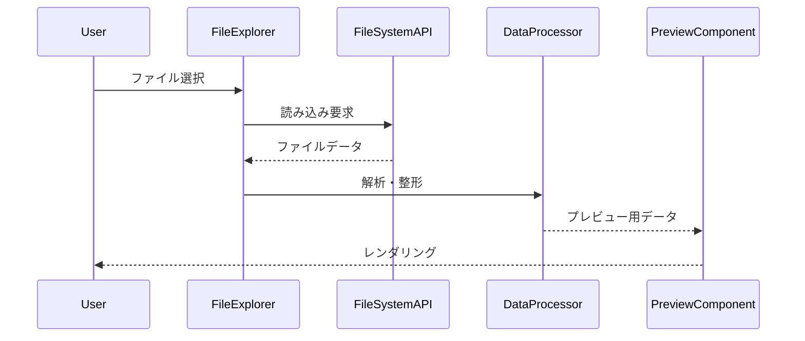
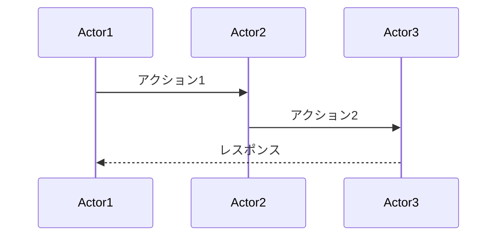

# シーケンス図ドキュメント

DataLoom Studio の主要フローを Mermaid シーケンス図で整理したドキュメントです。Markdown/データプレビュー/分析など、ユーザー操作からレンダリングまでの流れを可視化しています。

## 📊 マークダウン機能
- [**マークダウン_プレビュー_シーケンス図.mmd**](./マークダウン_プレビュー_シーケンス図.mmd) – ライブプレビューの基本処理
- [**マークダウンプレビュー_シーケンス図.mmd**](./マークダウンプレビュー_シーケンス図.mmd) – 詳細なレンダリングと Docx エクスポートフロー
- [**マークダウン_ツールバー_シーケンス図.mmd**](./マークダウン_ツールバー_シーケンス図.mmd) – ツールバー操作とショートカット
- [**マークダウン_モード切替_シーケンス図.mmd**](./マークダウン_モード切替_シーケンス図.mmd) – エディタ ⇔ プレビュー ⇔ 分割表示の切替

## 🎨 Mermaid 機能
- [**マーメイド_プレビュー_シーケンス図.mmd**](./マーメイド_プレビュー_シーケンス図.mmd)
- [**マーメイドプレビュー_シーケンス図.mmd**](./マーメイドプレビュー_シーケンス図.mmd)
- [**マーメイド_モード切替_シーケンス図.mmd**](./マーメイド_モード切替_シーケンス図.mmd)

Mermaid コードのレンダリング、React Flow ベースの GUI 編集、SVG/PNG エクスポートまでの一連の流れを記載しています。

## 📋 データプレビュー
- [**CSV_モード切替_シーケンス図.mmd**](./CSV_モード切替_シーケンス図.mmd)
- [**TSV_モード切替_シーケンス図.mmd**](./TSV_モード切替_シーケンス図.mmd)
- [**JSON_モード切替_シーケンス図.mmd**](./JSON_モード切替_シーケンス図.mmd)
- [**YAML_モード切替_シーケンス図.mmd**](./YAML_モード切替_シーケンス図.mmd)
- [**PDFプレビュー_シーケンス図.mmd**](./PDFプレビュー_シーケンス図.mmd)
- [**ノートブックプレビュー_シーケンス図.mmd**](./ノートブックプレビュー_シーケンス図.mmd)

CSV/TSV/JSON/YAML/Notebook/PDF など各フォーマットの読み込み・整形・レンダリングの手順を示します。

## 🗃️ データテーブル機能
- [**データテーブル_シーケンス図.mmd**](./データテーブル_シーケンス図.mmd)
- [**編集可能データテーブル_シーケンス図.mmd**](./編集可能データテーブル_シーケンス図.mmd)
- [**オブジェクトビューア_シーケンス図.mmd**](./オブジェクトビューア_シーケンス図.mmd)

列表示切替、編集モード、階層データ表示などインタラクティブな操作のフローを整理しています。

## 🔄 共通処理パターン

## ⚙️ 使い方
1. DataLoom Studio 内で `.mmd` ファイルを開き、プレビューモードに切り替えて確認
2. もしくは [Mermaid Live Editor](https://mermaid.live) や VS Code の Mermaid Preview で表示
3. 新しいフローを追加する場合はテンプレートをコピーし、アクター/メッセージを編集して保存

## 更新履歴
- 2025-01: DataLoom Studio への改称に伴い説明文を更新、共通パターンを再整理
- 今後: 複数ファイル分析や Git パネルのシーケンス図を追加予定
