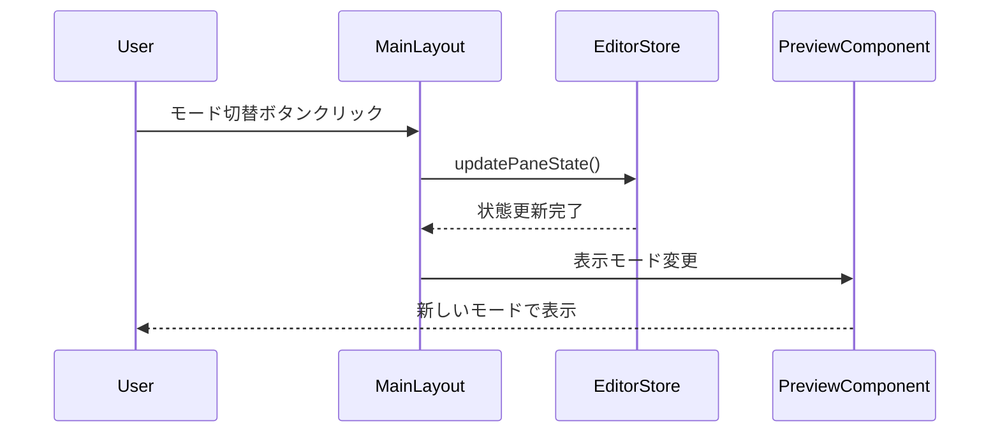
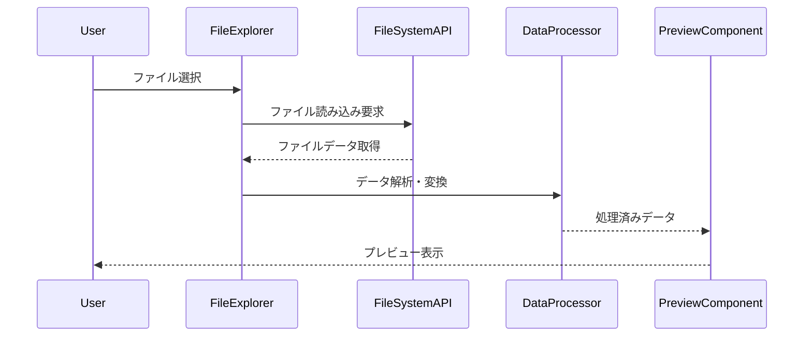
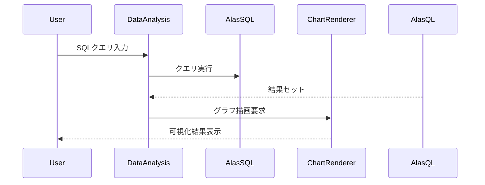
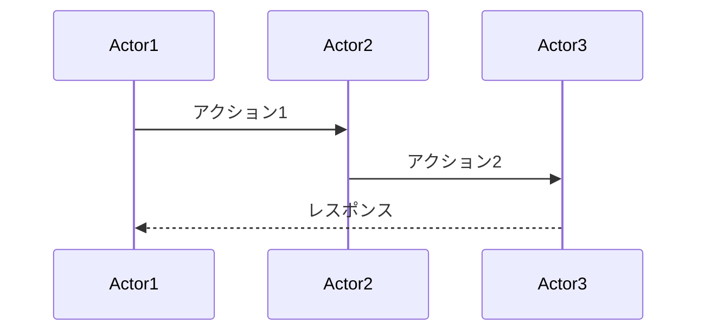

# シーケンス図ドキュメント

IDO Editor の各機能における動作フローを Mermaid シーケンス図で可視化したドキュメント集です。

## 📊 マークダウン機能

### プレビュー機能
- [**マークダウン_プレビュー_シーケンス図.mmd**](./マークダウン_プレビュー_シーケンス図.mmd) - マークダウンプレビューの基本フロー
- [**マークダウンプレビュー_シーケンス図.mmd**](./マークダウンプレビュー_シーケンス図.mmd) - 詳細なプレビューレンダリング処理

### ツールバー・編集機能  
- [**マークダウン_ツールバー_シーケンス図.mmd**](./マークダウン_ツールバー_シーケンス図.mmd) - ツールバー操作フロー

### モード切替
- [**マークダウン_モード切替_シーケンス図.mmd**](./マークダウン_モード切替_シーケンス図.mmd) - エディタ⇔プレビュー⇔分割表示の切替

## 🎨 Mermaid機能

### プレビュー・描画
- [**マーメイド_プレビュー_シーケンス図.mmd**](./マーメイド_プレビュー_シーケンス図.mmd) - Mermaidプレビューの基本フロー  
- [**マーメイドプレビュー_シーケンス図.mmd**](./マーメイドプレビュー_シーケンス図.mmd) - 詳細な図表描画処理

### モード切替
- [**マーメイド_モード切替_シーケンス図.mmd**](./マーメイド_モード切替_シーケンス図.mmd) - Mermaidファイルのモード切替フロー

## 📋 データプレビュー機能

### CSV/TSV データ
- [**CSV_モード切替_シーケンス図.mmd**](./CSV_モード切替_シーケンス図.mmd) - CSVファイルのモード切替処理
- [**TSV_モード切替_シーケンス図.mmd**](./TSV_モード切替_シーケンス図.mmd) - TSVファイルのモード切替処理

### JSON/YAML データ
- [**JSON_モード切替_シーケンス図.mmd**](./JSON_モード切替_シーケンス図.mmd) - JSONファイルのモード切替処理
- [**YAML_モード切替_シーケンス図.mmd**](./YAML_モード切替_シーケンス図.mmd) - YAMLファイルのモード切替処理

### 特殊ファイル形式
- [**PDFプレビュー_シーケンス図.mmd**](./PDFプレビュー_シーケンス図.mmd) - PDFプレビュー表示処理
- [**ノートブックプレビュー_シーケンス図.mmd**](./ノートブックプレビュー_シーケンス図.mmd) - Jupyter Notebook プレビュー

## 🗃️ データテーブル機能

### 基本テーブル表示
- [**データテーブル_シーケンス図.mmd**](./データテーブル_シーケンス図.mmd) - データテーブル基本表示フロー

### インタラクティブ機能
- [**編集可能データテーブル_シーケンス図.mmd**](./編集可能データテーブル_シーケンス図.mmd) - データ編集機能フロー
- [**オブジェクトビューア_シーケンス図.mmd**](./オブジェクトビューア_シーケンス図.mmd) - 階層データビューア操作

## 🔄 共通処理フロー

### 基本的なモード切替パターン

### データ読み込み共通パターン

## 📊 分析機能フロー（今後追加予定）

### SQLクエリ実行

## 🎯 使用方法

### シーケンス図の閲覧
1. **IDO Editor内での閲覧**: `.mmd`ファイルをIDO Editorで開いてプレビューモード表示
2. **Mermaid Live Editor**: https://mermaid.live でオンライン表示
3. **VSCode**: Mermaid Preview 拡張機能で表示

### カスタマイズ・追加
新しい機能のシーケンス図を追加する場合:

## 🔄 更新履歴

### 2024年12月
- 既存シーケンス図の整理・分類
- README作成による体系化
- 共通パターンの抽出・文書化

### 今後の拡張予定
- データ分析機能のシーケンス図追加
- エラーハンドリングフローの追加  
- パフォーマンス最適化プロセスの可視化